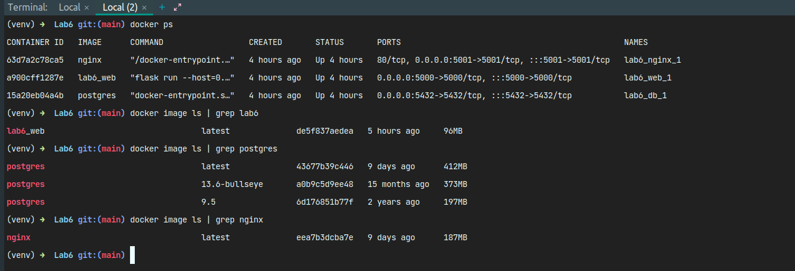

# داک پروژه 

در این قسمت به مستندات پروژه می‌پردازیم.

برای این آزمایش از داکر کامپوز برای بالا‌ آوردن میکروسرویس‌هایمان استفاده کردیم.

### WEB

میکروسرویس اول مربوط به وب می‌باشد که همان اپلیکیشن فلسکی است که با پایتون زده‌ایم و دو روکوئست GET و POST دارد که POST برای ثبت کردن یک نام و ایمیل است و GET  نیز برای گرفتن تمامی نام‌ها و ایمیل‌های متناظرشان است که تا به اینجا در دیتابیس ذخیره شده‌اند.

### DATABASE

برای دیتابیس از POSTGRES استفاده کردیم و آن را به عنوان یک کانتینر در داکر کامپوز بالا آوردیم و در اپلیکیشن وب از آن برای ذخیره کردن یوزر‌ها استفاده کردیم.

### NGINX

از سرویس nginx نیز به عنوان load balancer استفاده کردیم و کانفیگ آن را در nginx.conf قرار داده‌ایم که مشخصات را می‌توانید مشاهده کنید.
این سرویس روی پورت 5001 گوش می‌دهد و تمام رکوئست‌ها را به عنوان پروکسی به سرویس وب فلسک انتقال می‌دهد که روی پورت 5000 بالا آمده است.
پس با این کار هرگاه به آدرس لوکال هاست 5001 رکوئست بزنیم در واقع این رکوئست بین سرویس‌های وب لود بالانس می‌شود و به دستشان می‌رسد. البته در اینجا چون یک نمونه از وب اپلیکیشن بالا‌ آورده‌ایم، تمامی رکوئست‌ها به دست این نمونه از اپلیکیشن می‌رسند.

### تصاویر 

برای درخواست‌ها از POSTMAN استفاده کرده‌ایم.

POST REQUEST

ابتدا سه درخواست POST به سرویس می‌زنیم و سه تا یوزر ایجاد می‌کنیم. تصویر یکی از درخواست‌ها را می‌توانید در زیر مشاهده کنید.

GET REQUEST

سپس یک درخواست GET به سرویس می‌زنیم و لیست تمامی یوزر‌های ثبت شده را می‌گیریم که پاسخ را می‌توانید در تصویر زیر ببینید.

DEPLOYMENT DIAGRAM

در تصویر زیر نیز نمودار مستقر سازی با زبان uml را می‌توانید مشاهده کنید.

SERVICES LOGS

در این تصویر می‌توانید لاگ میکروسرویس‌ها در هنگام بالا آمدن با استفاده از docker-compose را مشاهده کنید.

COMMANDS

کامند‌های docker ps و docker image ls
را در تصویر زیر می‌توانید مشاهده کنید. که اولی مربوط به کانتینر‌هایی است که در حال حاضر روی لوکال بالا هستند و برای docker image ls نیز چون روی لوکال ایمیج‌های زیادی وجود داشت، آن را با grep به ایمیج‌هایی که در این آزمایش استفاده کرده بودیم، محدود کردیم.
همچنین برای ایمیج‌های مربوط به postgres نیز در این آزمایش از تگ latest آن استفاده شده است.

---

#پرسش‌ها  

#### ۱. از چه نمودار/نمودارهای UML ای برای مدل‌سازی معماری MicroService خود استفاده کرده‌اید؟ 

از نمودار مستقرسازی یا deployment برای نشان دادن اجزای معماری استفاده کردیم و همچنین طرفین ارتباطات در این نمودار را مشخص کرده‌ایم.

#### ۲. مفهوم Domain-driven Design یا DDD چه ارتباطی با معماری MicroService دارد؟ در حد دو-سه خط توضیح دهید. 

طراحی مبتنی بر دامنه (DDD) به مدل‌سازی دقیق دامنه‌ی کسب و کار می‌پردازد، و ارتباط DDD با معماری میکروسرویس این است که مفاهیم و تفاهمات دامنه‌ای از DDD می‌توانند به عنوان پایه‌ای برای طراحی و ارتباط میان میکروسرویس‌ها عمل کنند. این رویکرد باعث می‌شود که میکروسرویس‌ها با توجه به ساختار دامنه‌ای تعریف شده، مستقل و مدیریت‌پذیرتر طراحی شوند.

#### ۳. آیا Docker Compose یک ابزار Orchestration است؟ در حد دو-سه خط توضیح دهید. 

بله - Docker Compose به عنوان یک ابزار Orchestration در دنیای Docker شناخته می‌شود. این ابزار امکان تعریف، مدیریت، و اجرای برنامه‌های چند سرویسی در Docker را فراهم می‌کند همچنین این ابزار برای کانتینر‌ها یک شبکه ایزوله ایجاد می‌کند و ارتباطات بین کانتینر‌ها را نیز می‌تواند به خوبی مدیریت کند. قابلیت‌های فراوانی که داکر کامپوز در رابطه با مولتی کانتینر بودن برایمان فراهم می‌کند، اعم از مواردی که ذکر شد، این ابزار را به عنوان یک ابزار خوب و قوی orchestration مطرح کرده است.
نحوه استفاده از این ابزار را نیز می‌توانید در این پروژه مشاهده کنید که سرویس‌ها را چگونه مدیریت و با یکدیگر هماهنگ کرده‌ایم.
فایل docker-compose.yaml مثالی از نحوه نوشتن یک فایل داکر کامپوز برای سرویس‌ها می‌باشد که علاوه بر استفاده از ایمیج‌های گلوبال، یک ایمیج لوکال نیز بیلد شده است که همان ایمیج وب اپلیکیشن فلسک است.