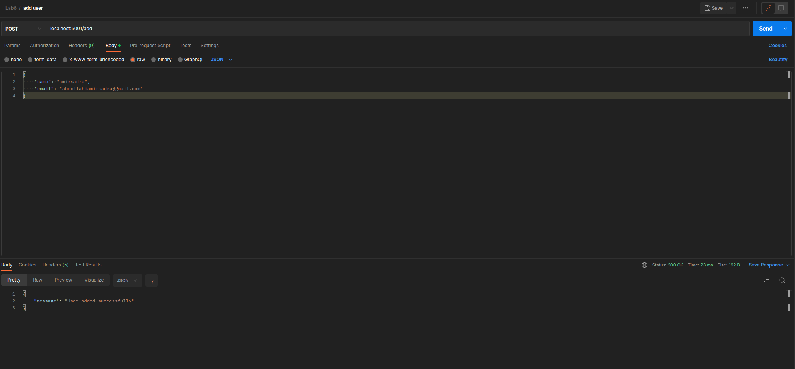
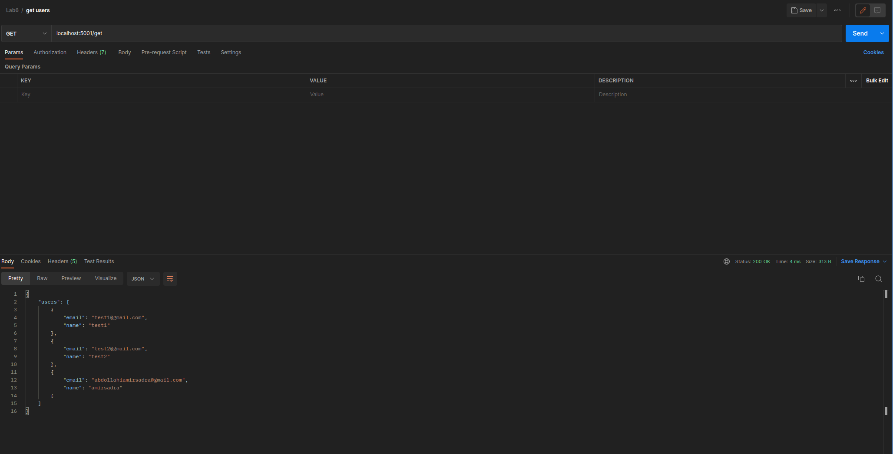
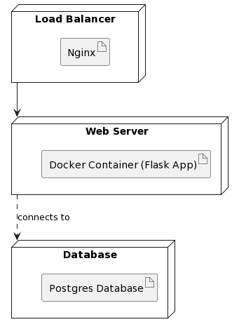
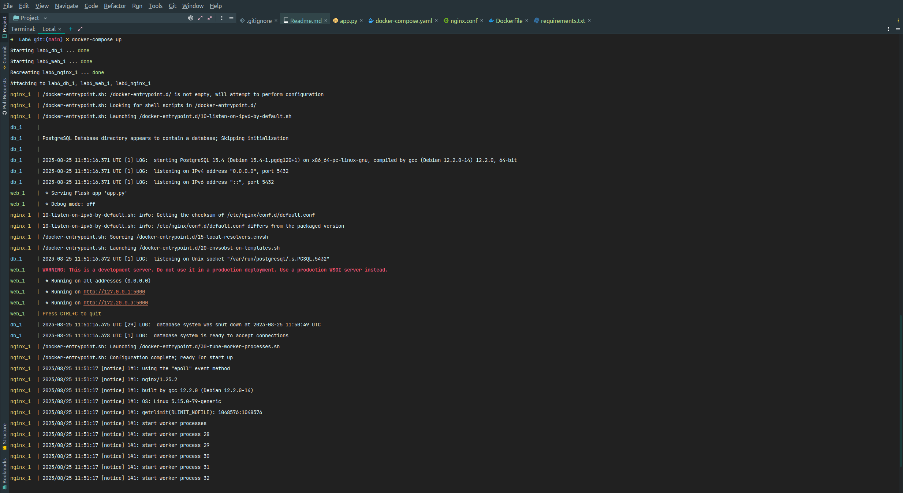

# داک پروژه 

در این قسمت به مستندات پروژه می‌پردازیم.

برای این آزمایش از داکر کامپوز برای بالا‌ آوردن میکروسرویس‌هایمان استفاده کردیم.

### WEB

میکروسرویس اول مربوط به وب می‌باشد که همان اپلیکیشن فلسکی است که با پایتون زده‌ایم و دو روکوئست GET و POST دارد که POST برای ثبت کردن یک نام و ایمیل است و GET  نیز برای گرفتن تمامی نام‌ها و ایمیل‌های متناظرشان است که تا به اینجا در دیتابیس ذخیره شده‌اند.

### DATABASE

برای دیتابیس از POSTGRES استفاده کردیم و آن را به عنوان یک کانتینر در داکر کامپوز بالا آوردیم و در اپلیکیشن وب از آن برای ذخیره کردن یوزر‌ها استفاده کردیم.

### NGINX

از سرویس nginxنیز به عنوان load balancer استفاده کردیم و کانفیگ آن را در nginx.conf قرار داده‌ایم که می‌توانید مشاهده کنید.
این سرویس روی پورت 5001 گوش می‌دهد و تمام رکوئست‌ها را به عنوان پروکسی به سرویس وب فلسک انتقال می‌دهد که روی پورت 5000 بالا آمده است.
پس با این کار هرگاه به آدرس لوکال هاست 5001 رکوئست بزنیم در واقع این رکوئست بین سرویس‌های وب لود بالانس می‌شود و به دستشان می‌رسد. البته در اینجا چون یک نمونه از وب اپلیکیشن بالا‌ آورده‌ایم، تمامی رکوئست‌ها به دست این نمونه از اپلیکیشن می‌رسند.

### تصاویر 

برای درخواست‌ها از POSTMAN استفاده کرده‌ایم.

ابتدا سه درخواست POST به سرویس می‌زنیم و سه تا یوزر ایجاد می‌کنیم. تصویر یکی از درخواست‌ها را می‌توانید در زیر مشاهده کنید.

سپس یک درخواست GET به سرویس می‌زنیم و لیست تمامی یوزر‌های ثبت شده را می‌گیریم که پاسخ را می‌توانید در تصویر زیر ببینید.

POST REQUEST

GET REQUEST

DEPLOYMENT DIAGRAM

SERVICE LOG

در این تصویر می‌توانید لاگ میکروسرویس‌ها در هنگام بالا آمدن با استفاده از docker-compose را مشاهده کنید.

---

#پرسش‌ها  

#### ۱. از چه نمودار/نمودارهای UML ای برای مدل‌سازی معماری MicroService خود استفاده کرده‌اید؟ 

از نمودار مستقرسازی یا deployment برای نشان دادن اجزای معماری استفاده کردیم و همچنین طرفین ارتباطات در این نمودار را مشخص کرده‌ایم.

#### ۲. مفهوم Domain-driven Design یا DDD چه ارتباطی با معماری MicroService دارد؟ در حد دو-سه خط توضیح دهید. 

توضیحات

#### ۴. آیا Docker Compose یک ابزار Orchestration است؟ در حد دو-سه خط توضیح دهید. 

بله - توضیحات